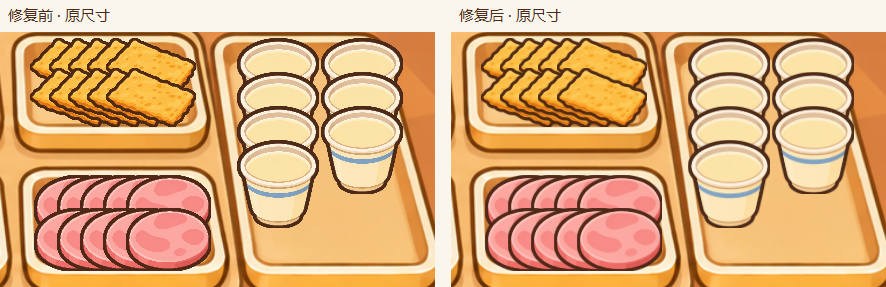
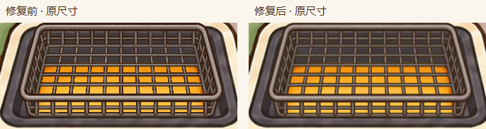
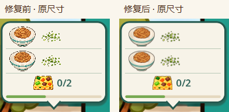
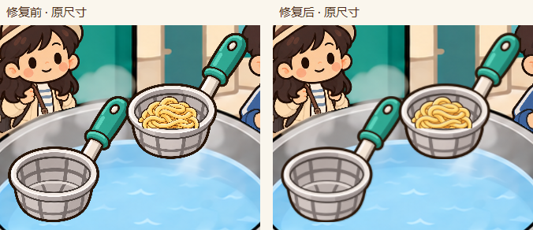

# 天津、武汉素材抗锯齿修复

日期：2026-09-12。对应此前的《天津武汉全解锁素材锯齿排查》。

## 修改

- 天津 22 张、武汉 20 张食物、工具及订单相关纹理开启 mipmap，针对大图缩小到营业页面时出现的阶梯与碎点。
- 两城营业页面统一使用 `LinearWithMipmaps`，覆盖工作台、订单图标、收银反馈和拖拽预览。武汉双勺及当前豆皮切块素材此前已开启 mipmap，继续复用。
- 天津煎饼画布的程序绘制椭圆开启边缘抗锯齿。
- 当前天津炸篮实际使用 v4 素材。本次保留原始图片、尺寸和棕色描边，不重画素材；顾客和背景不在本次纹理调整范围内。

## 验收

对比两城全商品解锁、最高等级设备在 1920×1080 和 1280×720 下的营业截图。天津杯口、油条轮廓、炸篮网格以及武汉面篮、订单面碗的锯齿和碎点明显减少，主要描边保持清楚。另完成武汉操作动画截图采集并检查拌面画面；没有将静态截图结果等同于动画闪烁量化测试。

- C# 构建通过，0 警告、0 错误。
- 实际加载核验：42 张纹理均包含 mipmap，两城营业页过滤设置正确。
- `OrderBubbleSelfTest`：322 项通过。
- `WuhanAnimationSelfTest`：188 项通过。
- `StageFourSelfTest`：5965 项通过。
- `WuhanDeliverySelfTest`：161 项通过。
- 共 6636 项自检通过，`git diff --check` 通过。

环境记录：编辑器批量导入完成后在退出阶段异常退出，随后独立运行的纹理加载核验与以上自检均通过。动画采集外层等待超时，但实际采集进程随后完成并输出 `WUHAN_ANIMATION_CAPTURE_DONE`。

## 原尺寸前后对比

以下直接裁切运行截图，左侧修复前、右侧修复后，未放大或锐化。

