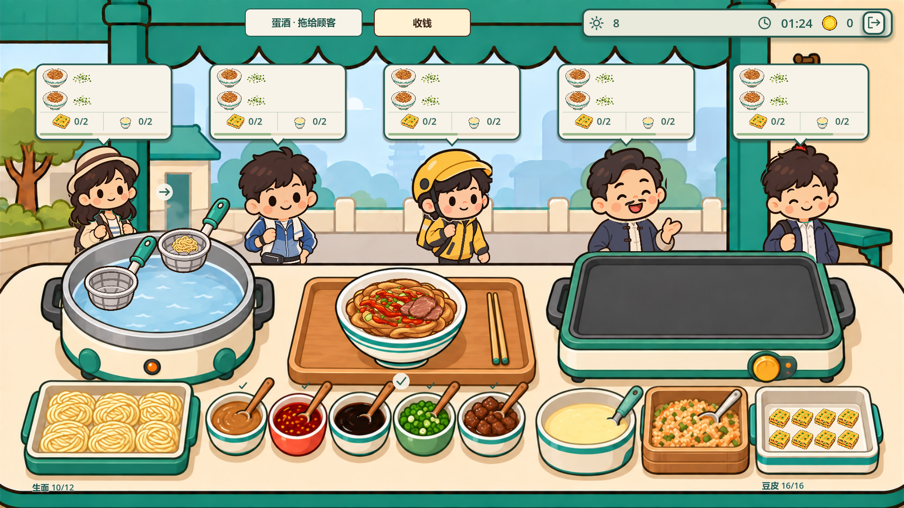
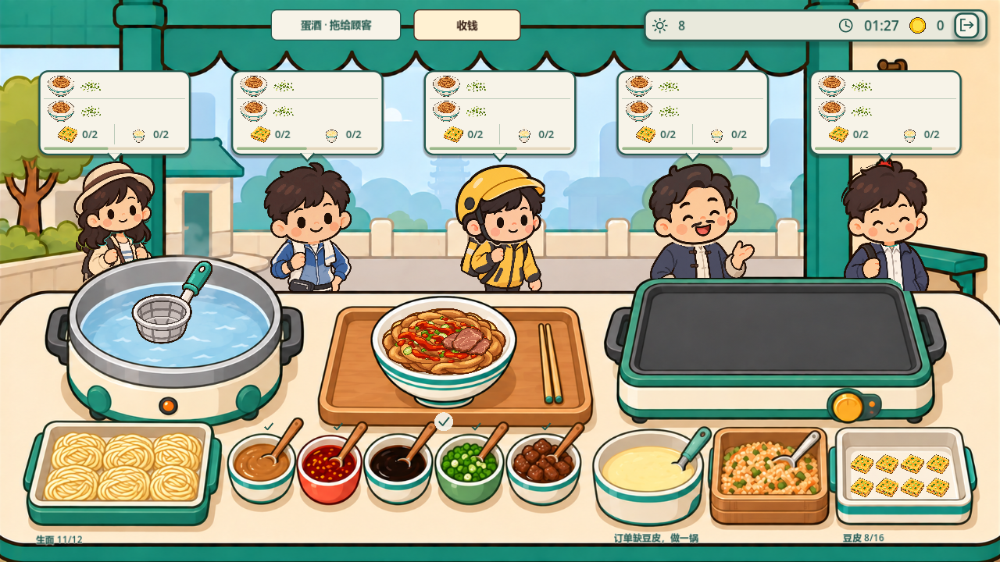
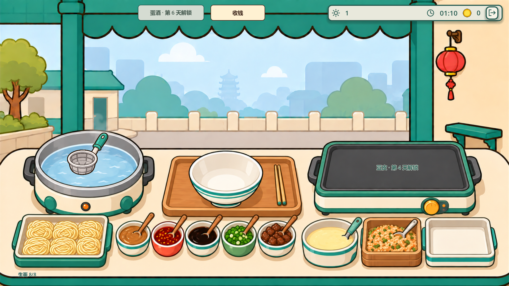

# 武汉整图工作台接入

2026-09-10。武汉营业页使用 `resource/art/Wuhan/武汉早餐铺主界面-热干面-豆皮-v1.png`。锅体、空碗、容器与托盘来自整图，制作内容和交互叠加在对应位置。

## 当前行为

- Lv1～Lv3 固定设备外形和锅面坐标；原制作速度、自动操作、双漏勺、备料容量及升级价格继续生效。经营首页设备卡使用固定缩略图，显示实际等级及升级信息。
- 豆皮第 4 天解锁；此前保留原图外观，锅面显示解锁提示，不能制作或交付。蛋酒第 6 天解锁，暂用顶部“蛋酒 · 拖给顾客”UI，继续持续供应。
- 金币盘暂改为顶部“收钱”按钮。结算收入、待收金额和飞金币反馈继续使用共享逻辑，反馈落点改为按钮中心；未点击的收入照常入账。
- 芝麻酱碗和深色酱汁碗共用基础调味动作。点击任意一碗后，再点另一碗不会重复添加。葱花、辣油与牛肉分别对应图上的容器。
- 生面库存以数量、缺料提示及补货按钮表达；图中六团生面不是库存容量。豆皮仍每锅 8 块，托盘最多 16 块，满盘时剩余成品留锅。
- 订单、关卡目标、解锁配置和存档结构未改动；五名顾客、部分交付耐心恢复、满意度及小费规则沿用原逻辑。

## 实现与后续换图

`WuhanWorkbenchLayout` 以原图 1672×941 标定操作区域，转换到项目 1920×1080 设计坐标。食物绘制、手势判定、交付拖拽及补货入口使用相同区域。锅沿按整图取样，遮挡顾客及动态漏勺；面碗交付预览也从整图轮廓取样。

`WuhanArtCatalog.WorkbenchBackground(bool doupiUnlocked)` 是营业底图入口，本次两个状态返回同一张 v1 图。收到未解锁图后，在该入口加入分支，同时更新场景初始背景；如果新图移动了设备，需同步标定布局，不能只替换文件。原始美术文件未重绘。

一并修复武汉经营首页仍引用已不存在的 `空工作台_v3.png` 的问题，改为现存 v4 资源。营业背景使用稳定的 `WorkbenchBackground` 节点名，避免自动生成节点名在长时间运行中的变化。

## 验证结果

| 检查 | 结果 |
| --- | --- |
| `dotnet build --no-restore` | 0 警告、0 错误 |
| `WuhanSelfTest` | 37 项通过 |
| `WuhanAnimationSelfTest` | 62 项通过 |
| `WuhanGestureSelfTest` | 1080p、720p 各 182 项通过 |
| `WuhanDeliverySelfTest` | 1080p、720p 各 132 项通过 |
| `WuhanDeliverySelfTest --capture --capture-720` | 最终渲染交付检查 148 项通过，复查拖拽预览 |
| `WuhanMainDeliverySelfTest` | 1080p、720p 各 18 项通过 |
| `WuhanClosingSelfTest` | 通过，含跨城市结算及未收金币 |
| `WuhanLedgerSelfTest` | 51 项通过 |
| `CoinCollectionSelfTest` | 788 项通过，包含天津/武汉、两种分辨率和减少动态模式 |
| `WuhanWorkbenchSelfTest` | 786 项通过，覆盖全部 12 天订单、配方、解锁和升级购买 |
| `WuhanVisualCapture --layout` | 1080p、720p 各 526 项通过，覆盖三级设备、五名顾客、0～16 块备货、补货和收钱 |
| `WuhanVisualCapture --stages` | 第 1、3、4、5、6、7、12 天渲染与解锁状态通过 |

全章节测试使用真实关卡订单和结算流程，在交付前构造合法成品状态，以检查每种订单均可完成；它不代表人工计时通关或三星难度验证。实际鼠标制作、动画计时、容量和失败取消行为由手势、动画、交付及真实 Main 场景测试覆盖。

测试均使用独立存档和显式可写日志。沙箱仍会报告默认用户目录的读取/着色器缓存限制，以及部分原有测试的退出资源提示；上述测试不依赖该目录，未修改玩家实际存档。

### 复查命令

在项目根目录运行，替换测试场景名即可复查对应检查：

```powershell
& 'D:/Godot/GodotSharp/Godot_v4.7.1-stable_mono_win64_console.exe' `
  --headless --path . --log-file "$env:TEMP/wuhan-workbench.log" `
  res://Scenes/Tests/WuhanWorkbenchSelfTest.tscn
```

`WuhanMainDeliverySelfTest` 使用开发直达入口，需追加 `-- --dev-ui`；其 720p 参数为 `--720`。手势和交付测试的 720p 参数为 `--capture-720`。

截图使用 `WuhanVisualCapture.tscn`，去掉 `--headless`，添加 `--rendering-method gl_compatibility`，末尾追加 `-- --layout` 或 `-- --stages`，720p 再追加 `--capture-720`。完整截图位于 `.tmp/wuhan-layout`、`.tmp/wuhan-integrated-stages`；关键结果保存在下方验收目录。

## 实际画面

### 三级设备、五名顾客与满盘



### 720p



### 第一天，豆皮和蛋酒尚未解锁


