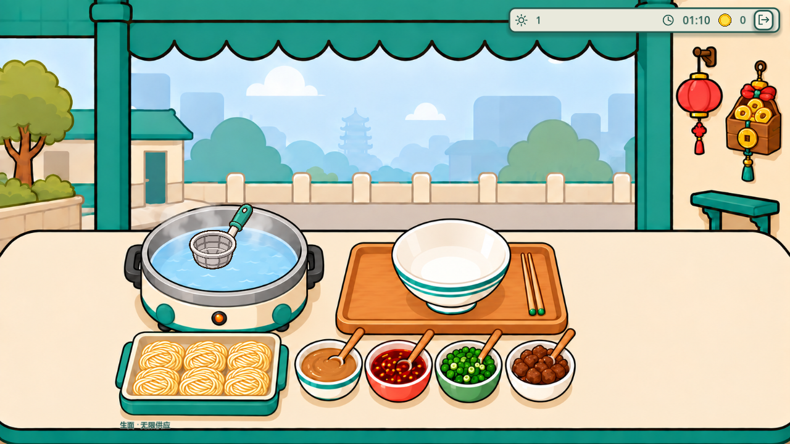
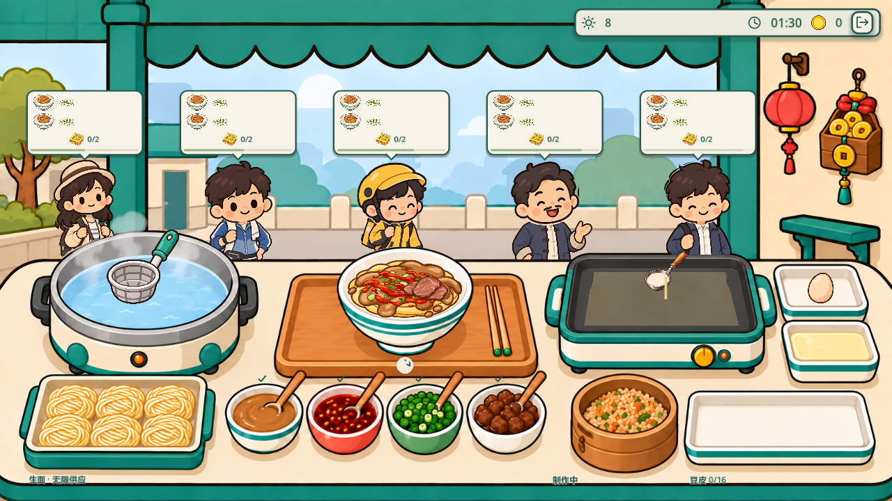
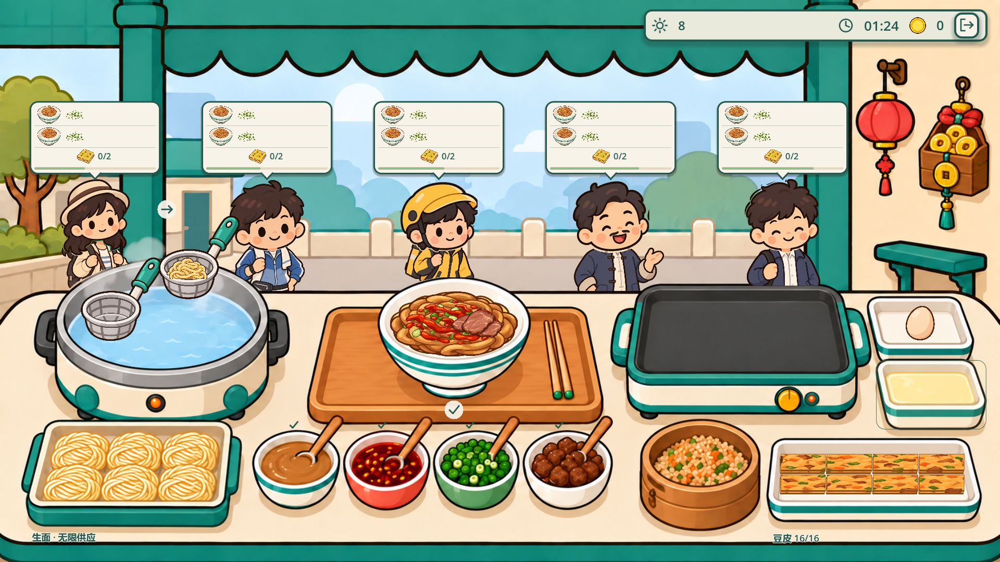
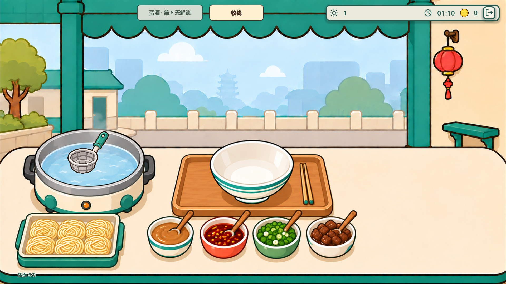
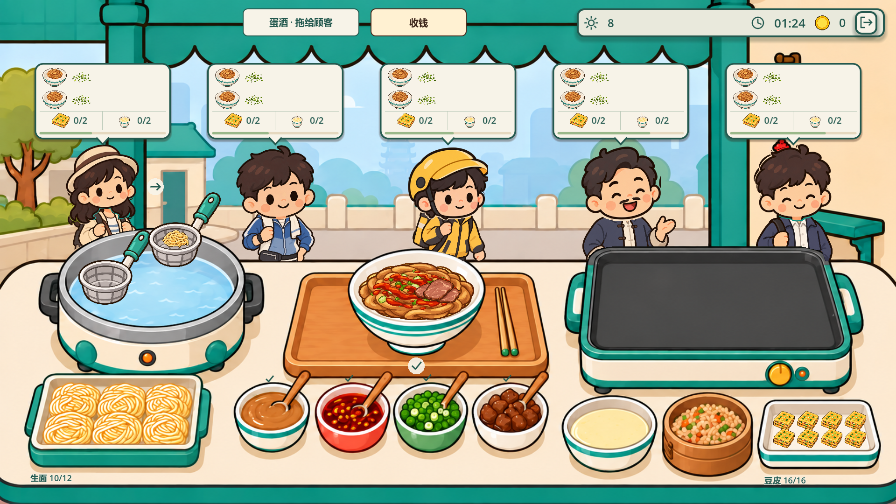
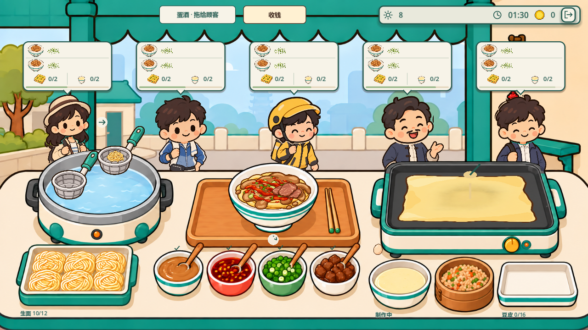
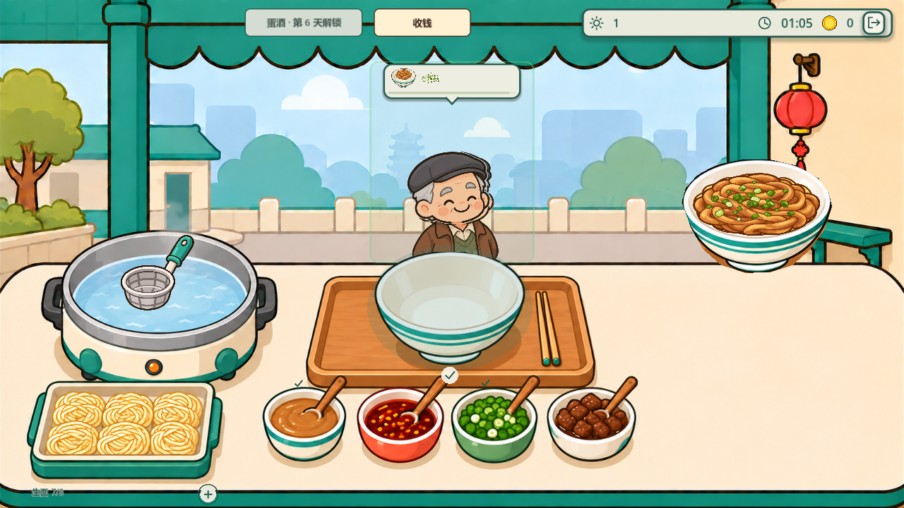

# 武汉整图工作台接入

2026-09-11 更新。武汉营业页按豆皮设备的实际解锁状态使用用户替换的两张原图：

- 未解锁：`resource/art/Wuhan/武汉-热干面.png`。
- 已解锁：`resource/art/Wuhan/武汉-热干面-豆皮.png`。

## 当前行为

豆皮沿用第 4 天解锁。此前右侧保持空桌面，没有豆皮制作、成品盘热区、悬停提示或解锁文字。蛋酒入口继续停用；豆皮鸡蛋仍用于制作豆皮。

两套图的面碗、调料和设备位置分别标定。基础调味由芝麻酱碗完成；旧图深色酱汁碗的独立热区已移除，连续点击芝麻酱仍只添加一次。葱花、辣油、牛肉对应新图中的容器。

Lv1～Lv3 沿用整图设备外形，速度、自动操作、双漏勺及升级价格照常生效。生面与调料沿用无限供应，补货入口保持隐藏。豆皮每锅 8 块、备货容量 16 块，满盘时余下成品留锅。

付款自动记账并飞币进入右侧挂件，点击挂件查看本次营业明细并暂停营业。五名同屏顾客、正确部分交付恢复 15% 耐心、完成订单顾客的满意度平均及小费四舍五入规则不变。配方、难度、存档结构、经营首页背景未改动。

## 实现

`WuhanArtCatalog.WorkbenchBackground(bool doupiUnlocked)` 返回对应新图。营业场景默认背景使用未解锁图，初始化时按实际豆皮设备状态更新。

新图按 1672×941 标定：未解锁阶段的煮面锅、碗、生面和四种调料整体比解锁阶段靠右约 200 源图像素，两套布局分别实例化。豆皮锅面四角为 `(1094,505)`、`(1374,505)`、`(1402,618)`、`(1076,618)`，绘制透视、翻面、铺馅与切块命中统一读取这组坐标。

豆皮锅右上方空托盘为鸡蛋，下方黄色托盘为豆米浆。鸡蛋热区为 `(1450,494,180,108)`，浆料热区为 `(1465,603,184,116)`；只在背景鸡蛋托盘内叠加现有鸡蛋，不再绘制独立托盘。锅下方竹容器供应馅料，右下方大托盘放成品。交互保持“拖浆入锅→点击鸡蛋→翻面→拖馅铺开→切块入盘”。

`WuhanWorkbenchLayout.ForStage(bool)` 选择两套 1672×941 源图坐标，并转换到 1920×1080 设计坐标。绘制、食物覆盖、手势、补货入口、成品拖拽和预览尺寸统一读取当前布局。锅沿遮挡、桌面前景、面碗轮廓和豆皮锅面同步标定。面碗高于桌沿的部分也纳入输入区域，可直接从碗沿拖出成品。

每次绑定工作台都更新布局、交付区域与预览尺寸、补货按钮，并清空旧悬停状态。新增测试复用同一营业页执行“第 1 天→第 4 天→第 1 天”，验证新存档和旧存档切换时不残留上一阶段位置。调料输入使用从原图读取的独立坐标，避免仅用布局常量验证自身。

## 本次验证（2026-09-11 替换背景）

- Godot 完成两张 PNG 重新导入；`dotnet build --no-restore` 为 0 警告、0 错误。
- 工作台 742 项、动画 85 项通过；手势在 1080p / 720p 各 548 项通过，包含独立原图坐标命中、阶段切换与真实鼠标制作流程。
- 交付在两种分辨率各 125 项、Main 场景交付各 18 项通过；共享收银测试 588 项通过，包含武汉两阶段挂件点击、飞币、营业明细与暂停。
- 两种分辨率均完成第 1、3、4、5、6、7、12 天截图；布局截图自检各 814 项通过，覆盖三级设备、五名顾客、制作中画面、0～16 块备货和营业明细。
- 截图自检同步修正旧版“小托盘固定尺寸、单图缩略图比例、扣减有限生面库存”的过时断言，改为验证新托盘内部四列两行的投影成品边界及无限供应；挂件坐标使用浮点近似比较。
- 自动加载默认用户存档及证书存储在沙箱中仍有权限日志；上述自检使用独立测试存档，不依赖默认玩家存档，也未修改玩家存档。

本次日志与代表画面保存在 [武汉新背景20260911](验收/武汉新背景20260911)。







## 历史验证结果（2026-09-10 v2，非本次结果）

| 检查 | 结果 |
| --- | --- |
| Godot 导入、`dotnet build --no-restore` | 新图加载成功；编译 0 警告、0 错误 |
| `WuhanWorkbenchSelfTest` | 786 项通过，覆盖全 12 天订单、配方、解锁及升级购买 |
| `WuhanGestureSelfTest` | 1080p、720p 各 210 项通过；包含两阶段切换后的真实制作、碗沿拖拽、失败拖拽、交付和补货 |
| `WuhanGestureSelfTest --capture` | 两种分辨率均通过；保存两阶段面条、成品与拖拽画面 |
| `WuhanDeliverySelfTest` | 1080p、720p 各 132 项通过 |
| `WuhanDeliverySelfTest --capture --capture-720` | 148 项通过，检查最终渲染拖拽预览 |
| `WuhanMainDeliverySelfTest` | 1080p、720p 各 21 项通过 |
| `WuhanSelfTest` / `WuhanAnimationSelfTest` | 37 / 62 项通过 |
| `WuhanClosingSelfTest` / `WuhanLedgerSelfTest` | 结算通过 / 手账 51 项通过 |
| `CoinCollectionSelfTest` | 788 项通过，覆盖共享收钱、两种分辨率及减少动态模式 |
| `WuhanVisualCapture --layout` | 1080p、720p 各 493 项通过；三级设备、五名顾客、0～16 块备货、补货和收钱 |
| `WuhanVisualCapture --stages` | 两种分辨率的第 1、3、4、5、6、7、12 天渲染和解锁状态通过 |

所有测试使用独立测试存档和显式可写日志。沙箱启动时的默认用户存档读取、证书存储和编辑器缓存限制仍会记录在日志中；部分既有测试有退出资源提示。测试夹具不依赖默认玩家存档，本次未修改玩家实际存档。收钱测试首轮在添加场景时出现 Godot .NET 桥接层 `Handle is not initialized` 日志，788 项断言仍通过；独立复跑同样 788 项通过，未再出现该异常，两轮日志均保留。

全 12 天订单测试在交付前构造合法成品，验证订单与进度可完成；不代表人工计时通关或三星难度验证。真实鼠标制作、动画计时、失败取消和交付由手势、动画和 Main 场景测试覆盖。新增阶段测试中的拖拽等待与现有交付测试一致，等待回弹/交付动画完成后再判断结果。

## 复查

在项目根目录运行，替换测试场景名即可：

```powershell
& 'D:/Godot/GodotSharp/Godot_v4.7.1-stable_mono_win64_console.exe' `
  --headless --path . --log-file "$env:TEMP/wuhan-v2-check.log" `
  res://Scenes/Tests/WuhanGestureSelfTest.tscn
```

手势和交付测试在 `--` 后追加 `--capture-720` 验证 720p。Main 场景测试追加 `-- --dev-ui`，720p 再追加 `--720`。

截图去掉 `--headless`，加 `--rendering-method gl_compatibility`。`WuhanVisualCapture` 在 `--` 后加 `--layout` 或 `--stages`；`WuhanGestureSelfTest` 加 `--capture`。完整截图位于 `.tmp/wuhan-layout`、`.tmp/wuhan-integrated-stages`、`.tmp/wuhan-v2-stage-motion` 和 `.tmp/wuhan-theme`。

本次日志和关键截图归档于 [武汉工作台V2](验收/武汉工作台V2)。此前 v1 截图与验收记录作为历史保留。

## 实际画面

初始工作台，右侧空桌面：



解锁后三级设备、五名顾客和满盘：



720p 制作中：



初始阶段拖拽成品：


